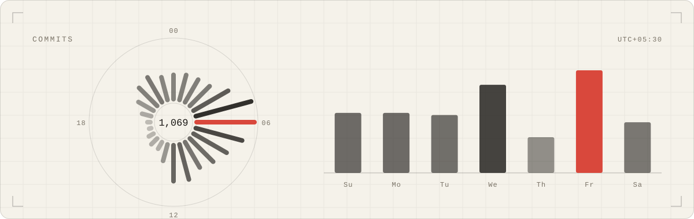
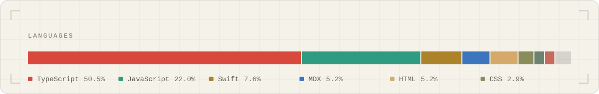
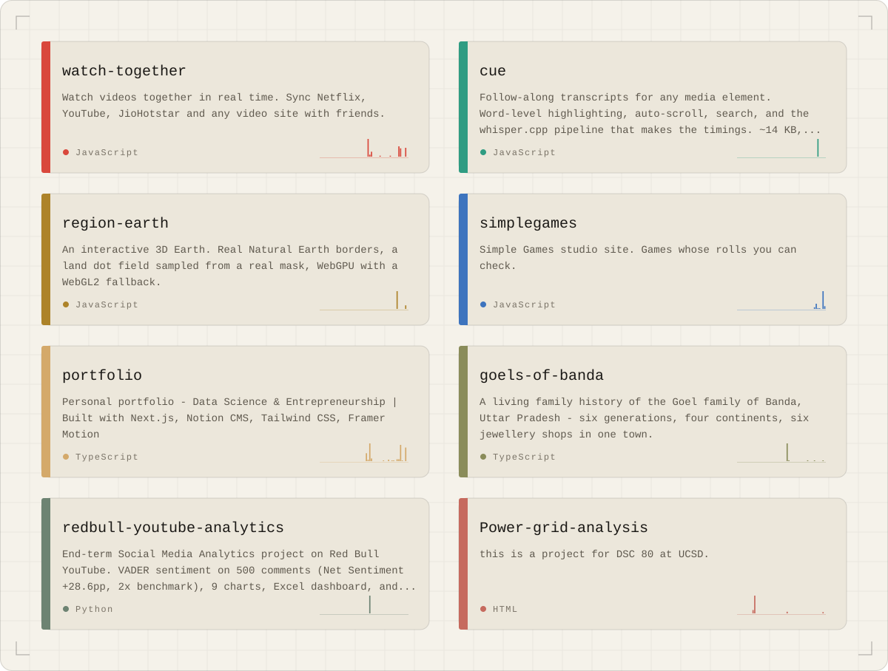

<picture>
  <source media="(prefers-color-scheme: dark)" srcset="assets/header-dark.svg">
  
</picture>

UCSD Data Science, graduating June 2026 - BS Data Science with a minor in Entrepreneurship & Innovation (UC GPA 3.911, major GPA 3.860).

<picture>
  <source media="(prefers-color-scheme: dark)" srcset="assets/telemetry-dark.svg">
  
</picture>

<picture>
  <source media="(prefers-color-scheme: dark)" srcset="assets/clock-dark.svg">
  
</picture>

**Currently building**
- Systematic-strategy research at **Triton Quantitative Trading** (UCSD)
- The full-stack platform for [Gondilal Saraf](https://gondilalsaraf.com) - my family's 110-year-old jewelry business

<picture>
  <source media="(prefers-color-scheme: dark)" srcset="assets/stack-dark.svg">
  
</picture>

**Recently shipped**
- Flask microservices for ADA's 50k-patient hospital platform (SWE Intern, Oct-Dec 2024)
- [Watch Together](https://chromewebstore.google.com/detail/kilmggcpfkcfpkaapillgloabbgmeeoa) - real-time video sync across Netflix / YouTube / Disney+ / Prime. Live on the Chrome Web Store.
- [Red Bull YouTube Sentiment Analytics](https://github.com/ArnavGoel03/redbull-youtube-analytics) - 500-comment VADER study, +28.6pp Net Sentiment Score (≈2× industry benchmark)
- [U.S. Power Outages (DSC 80)](https://github.com/ArnavGoel03/Power-grid-analysis) - Random Forest on 1,534 outages with fairness checks

<picture>
  <source media="(prefers-color-scheme: dark)" srcset="assets/repos-dark.svg">
  
</picture>

**What's next** 
Considering new-grad applied-scientist, ML-engineer, and SWE roles for summer 2026 onward - especially in health, commerce, or infrastructure. See [arnavgoel.dev/work](https://arnavgoel.dev/work) for specifics.

**Elsewhere** 
[arnavgoel.dev](https://arnavgoel.dev) · [LinkedIn](https://www.linkedin.com/in/arnav-goel--/) · [ORCID](https://orcid.org/0009-0007-6477-6501)

I go by Arnav publicly. Yash Goel is my legal name (UCSD transcripts, email, background checks).
